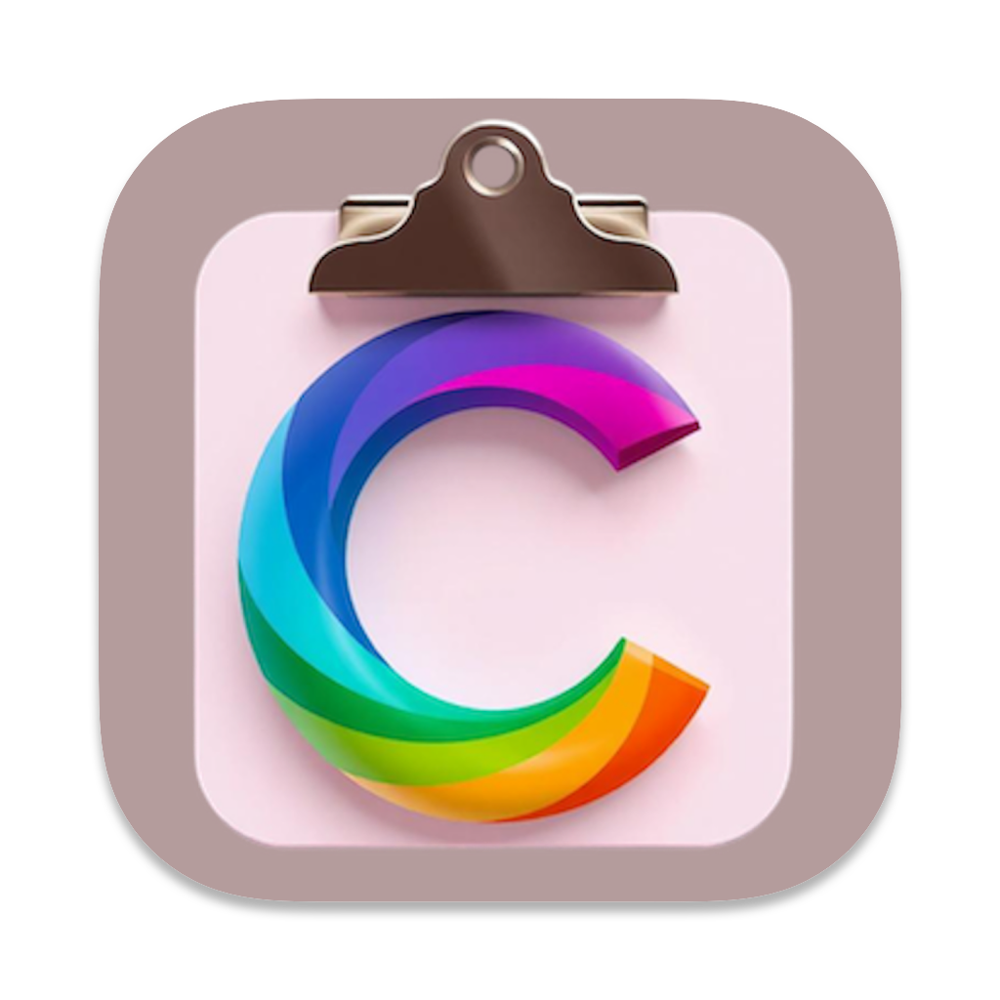
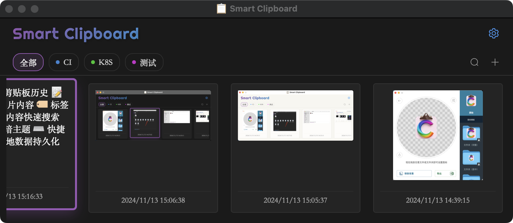
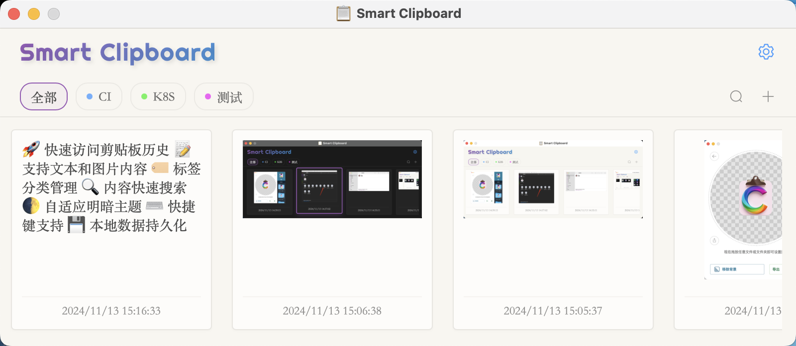

# Smart Clipboard

<div align="center">
  
</div>

> 一个现代化的剪贴板管理工具，支持文本和图片的快速复制、分类管理。

## 效果预览

### 暗黑模式



### 亮色模式



## 功能特点

- 🚀 快速访问剪贴板历史
- 📝 支持文本和图片内容
- 🏷️ 标签分类管理
- 🔍 内容快速搜索
- 🌓 自适应明暗主题
- ⌨️ 快捷键支持
- 💾 本地数据持久化

## 快捷键

- `Alt + C` 或 `Shift + Alt + V`: 显示/隐藏主窗口
- `/`: 快速搜索
- `←/→`: 在历史记录中导航
- `Enter`: 复制选中内容
- `Delete/Backspace`: 删除选中记录
- `Tab`: 切换到下一个标签
- `Shift + Tab`: 切换到上一个标签

## 环境要求

### 基础环境
- Go 1.18+
- Node.js 16+
- Wails v2

### Windows 依赖
- gcc (可通过安装 MinGW-w64 或 TDM-GCC 获得)
- WebView2 运行时

### macOS 依赖
- Xcode Command Line Tools
- App Store 开发者账号（如需打包发布）

### Linux 依赖
- gcc
- gtk3
- webkit2gtk3
- 基本构建工具

#### Ubuntu/Debian
```bash
sudo apt install build-essential libgtk-3-dev libwebkit2gtk-4.0-dev
```

#### Fedora
```bash
sudo dnf install gcc gtk3-devel webkit2gtk3-devel
```

#### Arch Linux
```bash
sudo pacman -S base-devel gtk3 webkit2gtk
```

## 安装指南

1. 克隆仓库
```bash
git clone https://github.com/JJ-H/clipboard.git
```

2. 进入项目目录
```bash
cd clipboard
```

3. 安装依赖并构建
```bash
# 安装前端依赖
make install

# 构建应用
make build
```

## 开发指南

```bash
# 开发模式
make dev

# 构建特定平台版本
make build-windows  # Windows
make build-mac      # macOS
make build-linux    # Linux

# 清理构建文件
make clean
```

## 许可证

MIT License
